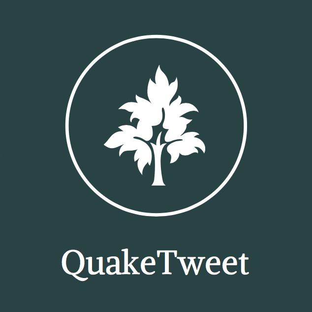
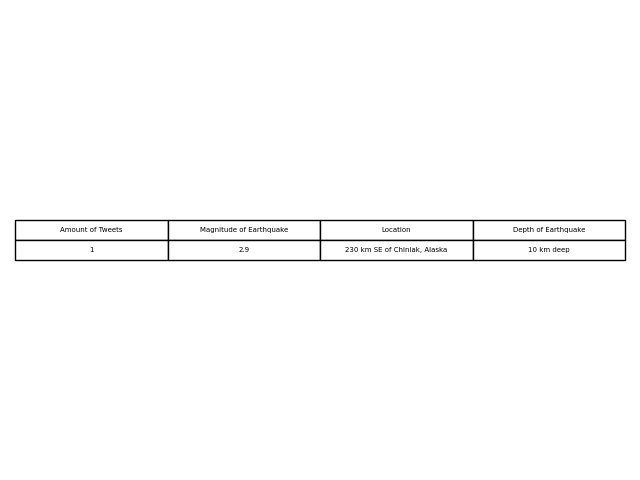
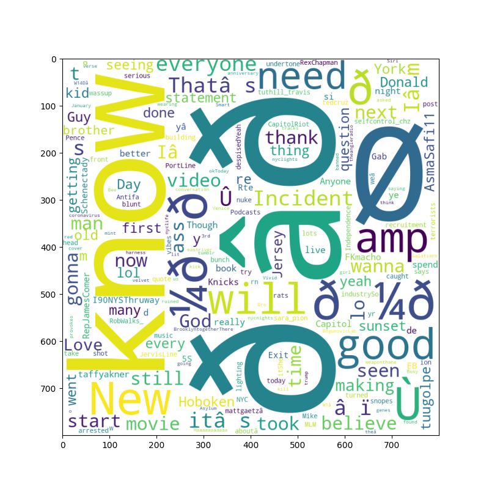

# Project Overview
Reporting tool that monitors for earthquakes in North American and creates a WordCloud of the most common words found in the tweets that following the event. Written exclusively in python and leverages AWS products – EC2, S3, and Lambda functions – to manage functionalities.

### Example outputs: 

 
# Reflection

### What was the context for this project?  
I wanted to work with live API feeds and parsing through the data. The USGS API provides a live feed for earthquake data which made it a perfect candidate for the project. As I gave the project more thought and did more research, I noticed that Twitter also offers a similar service through their API. I thought it would be interesting to see what people are tweeting shortly after an earthquake occurred and, since I had both feeds, at my disposal I set out to create it!

### What did you set out to build?
I set out to build something that had me working with live API feeds! I had a very wide scope and the project could’ve gone in any direction. 
	
### Why was this project challenging and therefore a really good learning experience?
Once I realized that I wanted to track both the earthquakes and the tweets I knew I was going to be challenged. Because of the unique monitoring requirement,  I knew that I my system had to have a triggering of some sort and had to run at all times. 

After researching different options, it became clear that I would be best suited by using AWS products to manage everything. I had never used an S3 bucket or a Lambda function prior to the project and knew that I there would be a steep learning curve.  After much trial and error, I was able to successfully set up everything and have the triggering that I needed.

### What were some unexpected obstacles?
The MOST TEDIOUS thing ever was getting the Lambda to accept all of the libraries that my script relied on. I was not expecting to spend as much time as I did researching and troubleshooting why I kept getting “failed to import xyz” on my Lambda. I eventually learned that I had to download and include the Linux based version of the libraries I was using. 

Tweepy also presented a unique obstacle. Although it is almost out-of-the-box solution to what I needed, I had to adjust the listener so that it would shut off after certain amount of time elapsed (as seen in StreamTweet.py).

### What tools did you use to implement this project?
I decided to go with AWS cloud products because I wanted exposure in tech I don’t use on a day to day basis. I chose to place my data in an S3 bucket rather than a database because I already have experience in working in databases. In all, everything is written in python and I used EC2, S3, and Lambda functions to do everything. 
